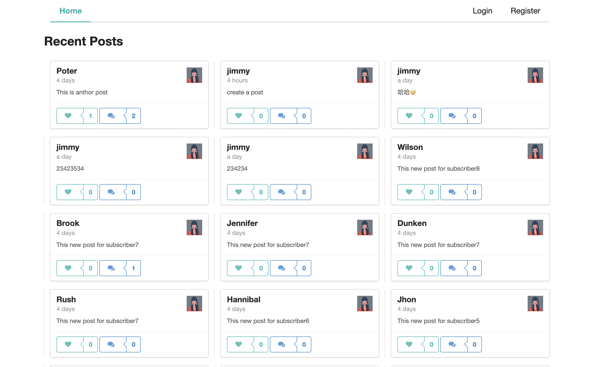
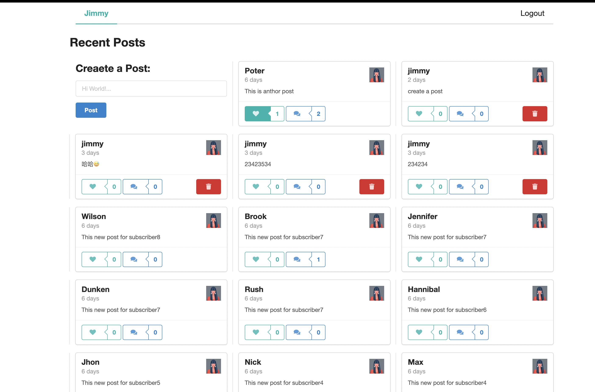

## MERN with NextJs and Graphql

CRUD Posts 

An application used to simple Crud post  built with: 

Frontend: React, Redux, NextJs Graphql

Backend: NodeJs, Express, MongDB Graphql

CI: vitest

CD: Vercel

## Project Status
(only necessary if incomplete)

## Project Screen Shot(s)
[ Not Login ]

[ With Login ]

## Installation and Setup Instructions

Clone down this repository. You will need `node` and `npm` installed globally on your machine.  

Installation:

`yarn install`  

To Run Test Suite:  

`yarn test`  

To Start App:

`yarn dev`  

To Build App:

`yarn build`  

To Visit App With local host:

Frontend: `localhost:3000`

To Visit App With remote host:

Frontend: `https://mern-next-ji123mmy.vercel.app`  (Host: Vercel)

Backtend: `https://mern-graphql-server.herokuapp.com/graphql`(Host: Heroku)

## Deploy on Vercel

The easiest way to deploy your Next.js app is to use the [Vercel Platform](https://vercel.com/new?utm_medium=default-template&filter=next.js&utm_source=create-next-app&utm_campaign=create-next-app-readme) from the creators of Next.js.

Check out our [Next.js deployment documentation](https://nextjs.org/docs/deployment) for more details.

